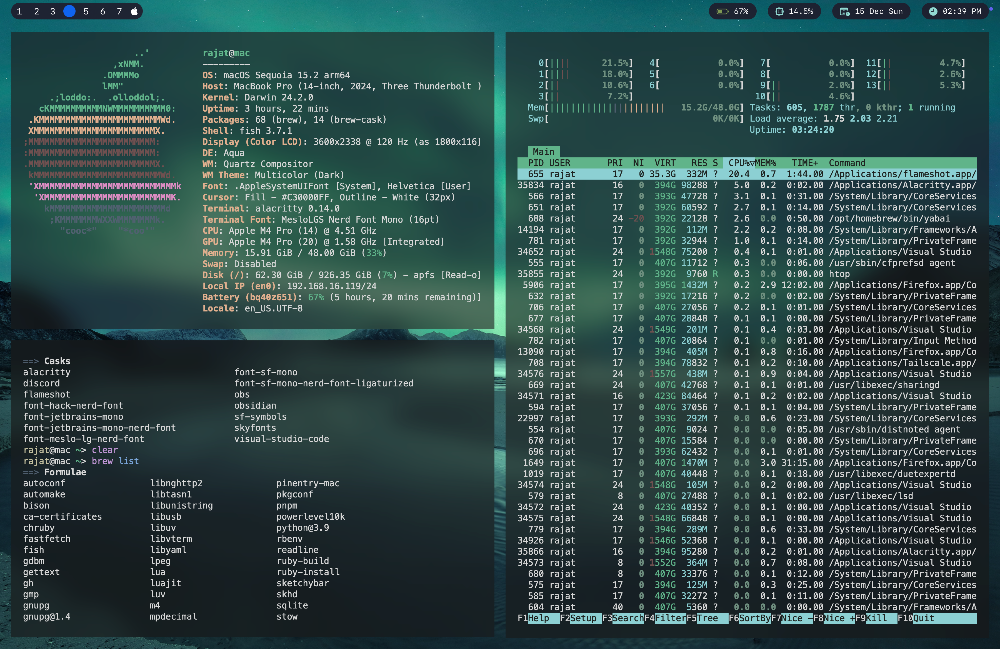

# MacOS Dots
I riced most of these from scratch. Copy at your own risk.

## Screenshots

#### Terminal Workspace

#### Code Workspace

#### Firefox Workspace

## Hardware

<!-- | Spec | Value | -->
| Model | M4 Pro |
|:---: |:---:|
| CPU | 14 Cores |
| GPU | 20 Cores |
| Neural Engine | 16 Cores |
| macOS | Sequoia |
| Screen | 14.2" Nano-texture @3024x1964 |
| RAM | 48 GB |
| SSD | 1 TB |

## What for what

| WM | [yabai](https://github.com/koekeishiya/yabai) |
|:---: |:---:|
| Bar | [sketchybar](https://github.com/FelixKratz/SketchyBar) |
| Wallpaper | [pexels](https://www.pexels.com/search/4k%20wallpaper/) |
| Hotkey Daemon | [skhd](https://github.com/koekeishiya/skhd) |
| Terminal | [Alacritty](https://github.com/alacritty/alacritty) |
| Shell | [fish](https://fishshell.com/) |
| Activity Monitor | [htop](https://htop.dev/) |
| Package Manager | [homebrew](https://brew.sh/) |

### Moto
Backup for my configs, can't rice my machine again and again ;)

